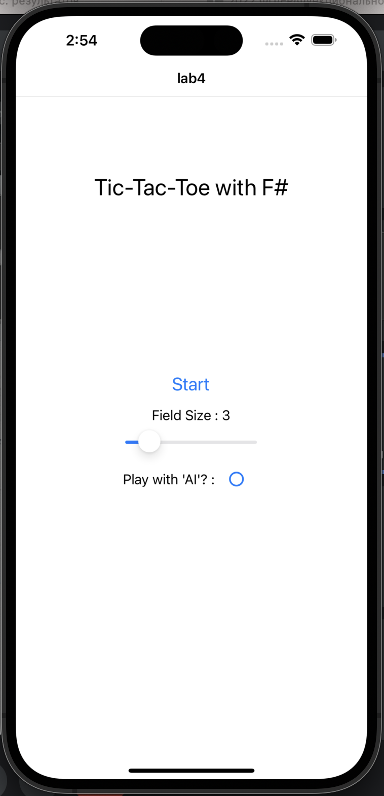
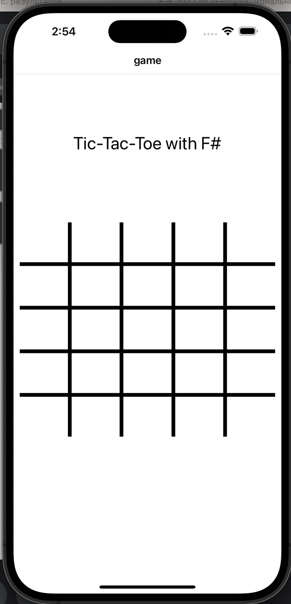
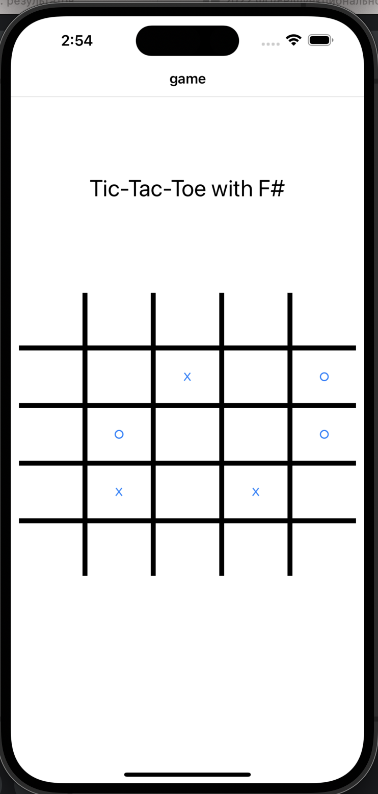
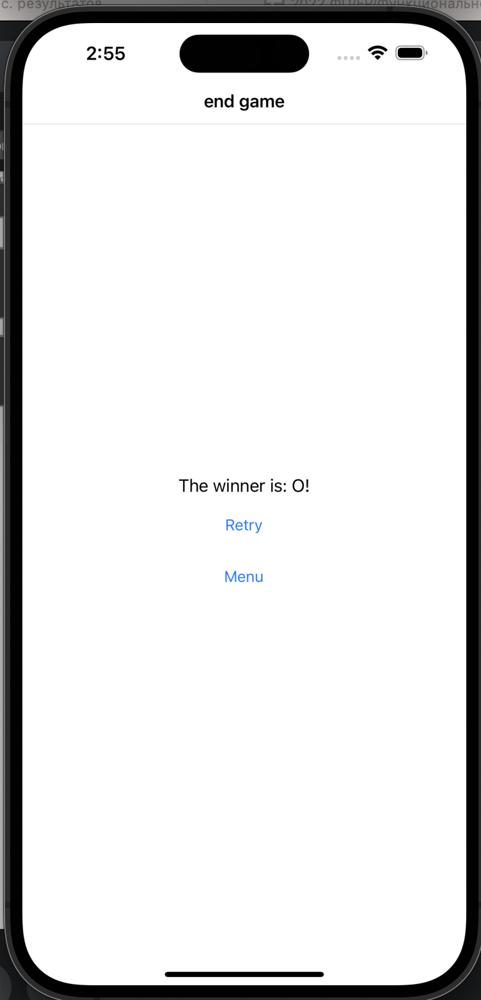

# Функциональное программирование
## Лабораторная работа 4

**Выполнил:** Лыщев Иван Антонович \
**Группа:** P34112 \
**Преподаватель:** Пенской Александр Владимирович

## Описание
В рамках лабораторной работы была реализована игра крестики-нолики для IOS.
Использовались такие фреймворки как Xamarin.Forms и Fabulous.
Xamarin.Forms предоставляет инструменты для написания кросс-платформанных приложений.
А Fabulous является фреймворком-оберткой, реализующей модель VMU. Таким образом всё мобильное
приложение строится по принципу написания состояния, функции его изменения и представления.

## Реализация
Рассмотрим MainPage. 
Описываем типы хранимых значений и типы action'ов
```fsharp
type Model = { n: int; withAi: bool }

type Msg =
    | Slide of float
    | Start
    | AiToggle
```
Функции инициализации и обновления от action'а
```fsharp
let init () = { n = 3; withAi = false }

let update msg model =
    match msg with
    | Slide v -> { model with n = int (Math.Round v) }, None
    | Start -> model, Some(GoTo.GamePage(model.n, model.withAi))
    | AiToggle -> { model with withAi = not model.withAi }, None
```
Реализация представления. Для этого используются объекты, предоставляемые Fabulous.
```fsharp
let view model =
    ContentPage(
        "lab4",
        (Grid(coldefs = [ Star ], rowdefs = [ Stars 5.5; Stars 9.; Stars 5. ]) {
            Label("Tic-Tac-Toe with F#")
                .font(namedSize = NamedSize.Title)
                .centerTextHorizontal()
                .centerTextVertical()
                .gridRow(0)
                .gridColumn (0)

            (VStack() {
                Button("Start", Start)
                    .font(namedSize = NamedSize.Large)
                    .borderWidth(2.)
                    .borderColor (FabColor.fromHex ("#ffffff"))

                Label($"Field Size : {model.n}").centerTextHorizontal ()
                Slider(2., 10., float model.n, (fun v -> Slide v))

                HStack() {
                    Label("Play with 'AI'? : ").centerHorizontal(true).centerTextVertical ()
                    CheckBox(model.withAi, (fun _ -> AiToggle))
                }

            })
                .centerHorizontal(true)
                .centerVertical(true)
                .gridRow(1)
                .gridColumn (0)

        })
    )
```
По такому же принципу реализуются остальные страницы. \

Реализация логики проверки победы
```fsharp
let checkWin (model: Model) : Model * Option<GoTo> =
    let field = model.Field

    let validations =
        seq {
            checkVertical field
            checkHorizontal field
            checkMainDiag field
            checkSubDiag field
        }

    if Seq.contains true validations then
        model, Some(GoTo.EndGamePage(model.Current, model.Size, model.WithAi))
    elif checkEnd field then
        model, Some(GoTo.EndGamePage(Null, model.Size, model.WithAi))
    else
        model, None
```
Проверяются строки, столбцы и диагонали. Как только одна проверка выдает true, остальные не выполняются.
Код проверки главной диагонали.
```fsharp
let checkSequential (array: Cell[]) =
    match array |> Array.distinct with
    | [| X |]
    | [| O |] -> true
    | _ -> false

let checkMainDiag (field: Cell[,]) : bool =
    checkSequential [| for i in 0 .. field.GetLength(0) - 1 -> field.[i, i] |]
```

Для навигации по страницам используется NavigationPage. Это своего рода стек, хранящий страницы. При необходимости мы кладем в стек или достаем для перехода вперед-назад.
```fsharp
let view (model: Model) =
    Application(
        (NavigationPage() {

            match model.MainPageModel with
            | Some mainModel -> View.map MainPageMsg (MainPage.view mainModel)
            | None -> ()

            match model.GamePageModel with
            | Some gameModel -> View.map GamePageMsg (GamePage.view gameModel)
            | None -> ()

            match model.EndGamePageModel with
            | Some endGameModel -> View.map EndGamePageMsg (EndGamePage.view endGameModel)
            | None -> ()
        })

    )
```
## Демонстрация
Начальный экран\
\
Начало игры \
 \
Ход \
 \
Конец игры \

## Тестирование 
Поскольку у нас реализован MVU, то работаем мы всегда с функциями, что очень удобно в тестировании. \
Пример написания теста 
```fsharp
[<Theory>]
[<InlineData("all_x.txt", true)>]
[<InlineData("horizontal_x.txt", true)>]
[<InlineData("vert_x.txt", false)>]
[<InlineData("mainDiag_x.txt", false)>]
[<InlineData("subDiag_x.txt", false)>]
let ``test horizontal win`` (path, exp) =
    let data = initData path
    Assert.Equal(exp, checkHorizontal data)
```

## Выводы
На удивление, написание мобильного приложения на F# оказалось не таким сложным, как ожидалось.
Большую долю задач решают фреймворки, для програмиста остается непосредственно написание логики и представления. 
Единственной весомой головной болью стало отсутсвие документации, приходилось много копаться в исходном коде. Но это можно обусловить малой популярностью 